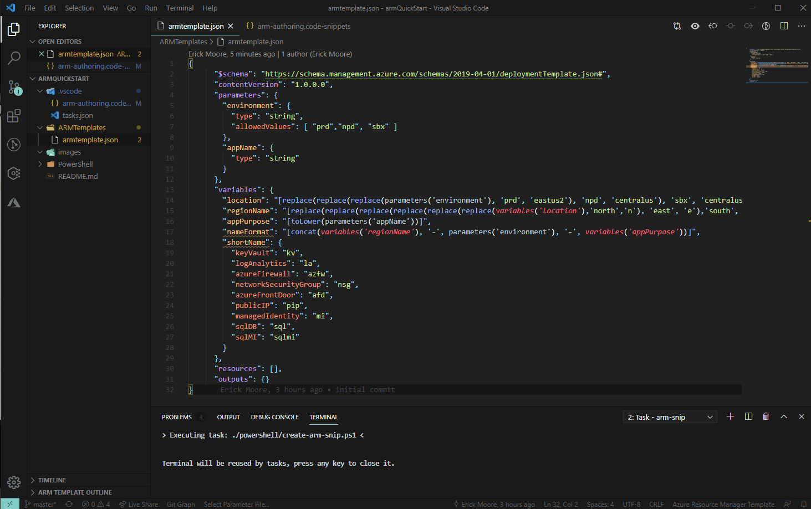
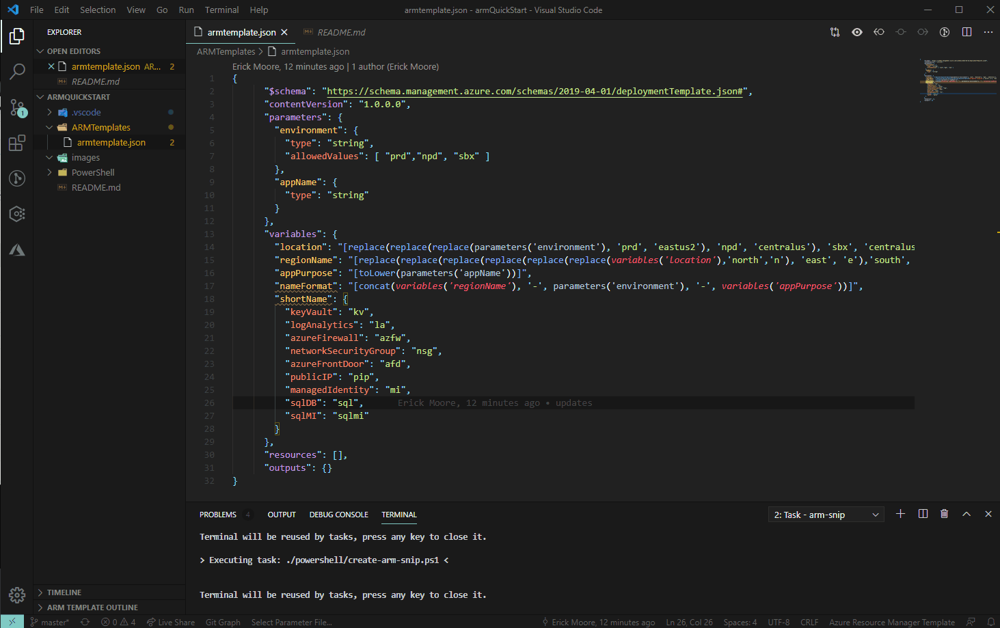
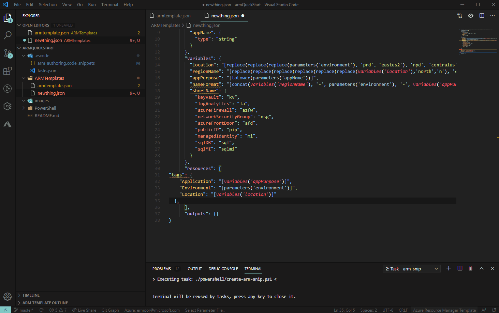

## ARM Authoring Quick Start

### This is some simple tooling to improve the experience of authoring ARM templates.

1. Clone this repo
2. Open up in VSCode
3. Copy the JSON you want to turn into a snippet
4. Open the command pallete
5. Run the task: arm-snip
6. Enjoy your re-usable snippets!

##

1. Start by building out your base template with all the items specific to your environment (naming standards, parameters, etc.)

2. As soon as you capture the Snippet you can use it to deploy.

3. You can turn anything you want to re-use into a Snippet. Here we build a "tags" snip, create a User Assigned Managed Identity (UAMI), apply our new tags Snippet, and create a new "uami" Snippet.

